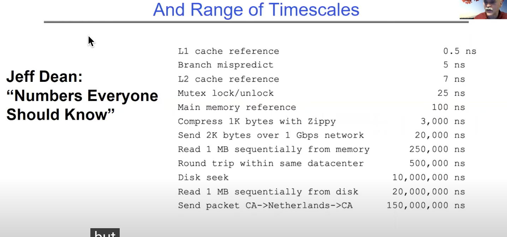

## Numbers EveryOne Should Know

<!-- display image: 1.png -->

  

1 ns = 1 nanosecond = 10^-9 seconds
1 μs = 1 microsecond = 10^-6 seconds
1 ms = 1 millisecond = 10^-3 seconds
1 s = 1 second

1 KB = 1 Kilobyte = 1024 bytes = 2^10 bytes
1 MB = 1 Megabyte = 1024 KB = 2^20 bytes
1 GB = 1 Gigabyte = 1024 MB = 2^30 bytes
1 TB = 1 Terabyte = 1024 GB = 2^40 bytes
1 PB = 1 Petabyte = 1024 TB = 2^50 bytes
1 EB = 1 Exabyte = 1024 PB = 2^60 bytes

This image provides a list of various computer operations and their associated latencies, measured in nanoseconds (ns). Here’s a breakdown of what each operation means and its latency:

1. **L1 cache reference**: 0.5 ns

   - This is the time it takes to access data from the Level 1 (L1) cache, which is the fastest cache memory located very close to the CPU.

2. **Branch mispredict**: 5 ns

   - The time penalty incurred when the CPU incorrectly predicts the path of a branch instruction and has to correct it.

3. **L2 cache reference**: 7 ns

   - The time it takes to access data from the Level 2 (L2) cache, which is slower than L1 cache but still much faster than main memory.

4. **Mutex lock/unlock**: 25 ns

   - The time it takes to acquire and release a mutex lock, which is a synchronization primitive used to protect shared data in concurrent programming.

5. **Main memory reference**: 100 ns

   - The time it takes to access data from the main memory (RAM).

6. **Compress 1K bytes with Zippy**: 3,000 ns (3 microseconds)

   - The time it takes to compress 1 kilobyte (KB) of data using the Zippy compression algorithm.

7. **Send 2K bytes over 1 Gbps network**: 20,000 ns (20 microseconds)

   - The time it takes to send 2 kilobytes (KB) of data over a 1 gigabit per second (Gbps) network.

8. **Read 1 MB sequentially from memory**: 250,000 ns (250 microseconds)

   - The time it takes to read 1 megabyte (MB) of data sequentially from memory.

9. **Round trip within same datacenter**: 500,000 ns (500 microseconds)

   - The time it takes for a data packet to make a round trip within the same data center.

10. **Disk seek**: 10,000,000 ns (10 milliseconds)

    - The time it takes for the disk’s read/write head to move to the location of the data on a hard disk drive.

11. **Read 1 MB sequentially from disk**: 20,000,000 ns (20 milliseconds)

    - The time it takes to read 1 megabyte (MB) of data sequentially from a disk.

12. **Send packet CA -> Netherlands -> CA**: 150,000,000 ns (150 milliseconds)
    - The time it takes for a data packet to travel from California (CA) to the Netherlands and back.

These latencies provide an idea of how quickly various operations can be performed in a computer system, highlighting the vast differences in speed between accessing cache memory, main memory, and disk storage, as well as the time it takes for data to travel across networks.

## What is an Operating System?

(1) Make the incredible advance in the uderlying technology available to a rapidly envolving body of applications

- Provide consistent abstractions for applications, even on different hardware
- Manage sharing of resources among multiple applications
  (2)
